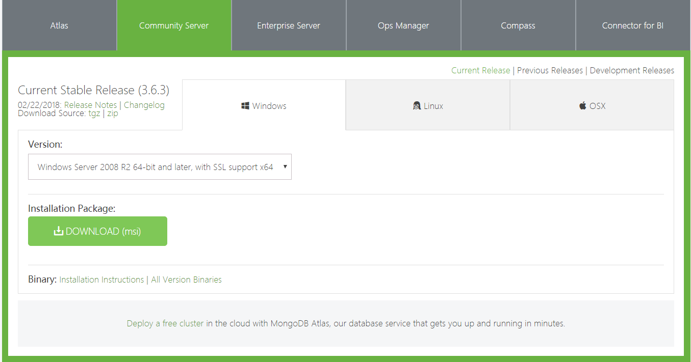
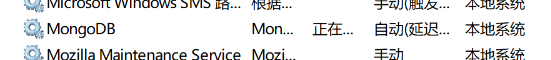

# LearnMongoDB

## 概述

>MongoDB 是一个基于分布式文件存储的数据库。由 C++ 语言编写。旨在为 WEB 应用提供可扩展的高性能数据存储解决方案。

>MongoDB 是一个介于关系数据库和非关系数据库之间的产品，是非关系数据库当中功能最丰富，最像关系数据库的。

## 特点

高扩展性、分布式存储、低成本、结构灵活

## Windows下 MongoDB 安装和环境搭建

官网下载地址 https://www.mongodb.com/download-center?jmp=nav#community



windows 64 的直接点击下载即可，windows 32 的需要下载 3.2的版本，可以到绿色按钮下方 [All Version Binaries](https://www.mongodb.org/dl/win32/x86_64-2008plus-ssl?_ga=2.10785079.249038257.1520656142-372372817.1520656142) 中下载

一步步安装，模式的时候选择顾客版，按默认位置下载即可

我因为有强迫症，我下载的东西都不会下载到 c 盘，所以我还是把他安装到了 D 盘。路径就是根目录 D 盘。然后我在 MongoDB 文件夹的旁边建了一个 MongoDBR 的文件夹，这个名字无所谓。然后下面是文件的具体配置 

在d:\MongoDBR（可随意起）下面建一个data文件夹

在d:\MongoDBR（可随意起）下面建一个logs文件夹，在里面建一个文件mongo.log

在d:\MongoDBR（可随意起）下面建一个etc(随意起，放配置文件)文件夹，在里面建一个文件 mongo.conf

打开mongo.conf文件，添加如下字段：

```conf
#数据库路径

dbpath=c:\MongoDB\data\
#日志输出文件路径

logpath=c:\MongoDB\logs\mongodb.log
#错误日志采用追加模式，配置这个选项后mongodb的日志会追加到现有的日志文件，而不是从新创建一个新文件

logappend=true
#启用日志文件，默认启用

journal=true
#这个选项可以过滤掉一些无用的日志信息，若需要调试使用请设置为false

quiet=false
#端口号 默认为27017

port=27017
#指定存储引擎（默认先不加此引擎，如果报错了，大家在加进去）

storageEngine=mmapv1
```

完成以上操作后，我们就可以启动我们的 mongo 数据库了。

然后用管理员权限运行 cmd ，运行如下代码

```shell
mongod --dbpath c:\MongoDB\data
```

以上代码只是启动 MongoDB 的服务，如果想要使用 mongoDB 需要再打开另一个 cmd 进入到 MongoDB\bin 中运行 mongo 来连接 mongoDB ，当然，毕竟这样太麻烦

因此可以使用下面代码，在进入 MongDB\bin 中输入

```shell
mongod --dbpath d:\MongoDBR\data --logpath d:\MongoDBR\log\mongo.log --journal
```

这样就会自动开启服务



不想影响开机时间可以设置为自动延迟，另外，现在下载 mongoDB 会自带一个 MongoDB Compass 工具，开启 MongoDB 服务后，直接连接就可以，具体使用接下来再说~
