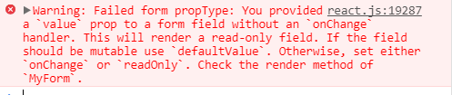

# React

> A JavaScript Library for building user interfaces

用来构建**用户界面**的js库,在**DOM操作非常频繁**的情况下推荐使用 :smile:

## 编码规范

https://segmentfault.com/a/1190000005825618

## 特点

- 组件化的思维模式
- 声明式的设计
- 高效、灵活
- JSX 基于js语法的扩展


## 搭建

- CLI
- 引入对应的js文件

## 使用

### render()

```js
ReactDOM.render(要渲染的元素，容器);

ReactDOM.render(
  <h1>Hello React</h1>,
  document.getElementById('box')
)

```

### 核心思想和核心概念

**核心思想：** 组件化

**概念：** 组件 JSX VirtualDOM 单向数据流

### jsx语法

遇到``{}``就会使用**js**来解析，遇到``<>``就会使用**html**来解析

相关更多的语法可以去[菜鸟教程](http://www.runoob.com/react/react-jsx.html)中去了解

**注意事项**

react规定渲染的元素有多个，指定在顶层标签中

### 组件的创建和使用

```js
//创建方法一
var Test = React.createClass({
  render:function(){
    return <p>test</p>
  }
})

//创建方法二
class Test extends React.Component {
  render() {
    return (
      <p>
        test
      </p>
    )
  }
}

//使用
<Test></Test>
```

**注意事项**

组件名称首字母必须是大写的，遵循驼峰式

返回多个元素时，放到顶层标签中，在``return``时，顶层标签不能直接换行
```js
return <div>
..
..
</div>

or

return (
  <div>
    ..
    ..
  </div>
)
```

在创建组件时，一定要写上render方法,用来指定渲染的内容

#### 复合组件

一个普通的组件，只不过其中包含其它的组件

### props

在使用组件的过程中是可以使用属性传递给组件值，接收的时候是通过``this.props``对象读取属性所对应的值

```js
var Button = React.createClass({
  render:function(){
    return <button>{this.props.name}</button>
  }
})

ReactDOM.render(
  <Button Btname="登录"></Button>,
  document.getElementById('example')
)
//在页面上就会显示一个<button>登录</button>
```


组件不仅可以通过属性传递值，还可以通过属性传递方法，执行方法依然是通过``this.props.属性名字``,props对象中的属性和调用的组件指定的属性是一一对应的，有一个比较特殊``this.props.children``

```js
var Button = React.createClass({
  btnClick:function(){
    console.log(1);
    this.props.funcClick();
  },
  render:function(){
    //绑定事件要采用驼峰命名
    return <button onClick={this.btnClick}>{this.props.name}</button>
  }
})

var ButtonGroup = React.createClass({
  showAlert:function(){
    alert("1");
  },
  showConsle:function(){
    console.log(2);
  },
  render:function(){
    return <div>
        <Button name="登录" funcClick={this.showAlert}></Button>
        <Button name="注册" funcClick={this.showConsle}></Button>
      </div>
  }
})

ReactDOM.render(
  <ButtonGroup></ButtonGroup>,
    document.getElementById('example')
)

//点击登录按钮 弹出1控制台打印1
//点击注册按钮 控制台打印1 2
```


### this.props.children

它不是一一对应的，它其中包含着所有的子节点

```js
var ListComponet = React.createClass({
  showList:function(){
    return React.Children.map(this.props.children,child){
      return <li>{child}</li>
    }
  },
  render:function(){
    return <ul>
      {this.showList()}
    </ul>
  }
})

ReactDOM.render(
  <ListComponet>
    <p>test1</p>
    <p>test2</p>
    <p>test3</p>
  </ListComponet>,
  document.getElementById('example')
)

//会显示<ul><li>test1</lit><li>test2</lit><li>test3</lit></ul>
```

### VDOM

virtual dom 虚拟DOM
组件并不是真实的DOM节点，而是存在内存中的一种数据结构，称之为VDOM，只有组件插入到文档之后，才会变成真实的DOM

>DIFF算法：当组件中有用户交互或者数据修改时，通过广度优先算法对比虚拟DOM和真实DOM，找到真正需要更新的DOM节点，**最大限度的减少对DOM的操作**


### refs 

从组件中获取真实DOM节点

```js
var InputGroup = React.createClass({
  handleClick:function(){
    console.log(this.refs.inputText.value);
  },
  render:function(){
    return <div>
      <button onClick={this.handleClick}>点击</button>
      <input ref="inputText"/>
    </div>
  }
}) 

ReactDOM.render(
  <InputGroup></InputGroup>,
  document.getElementById('example')
)
```


### state

>组件免不了要与用户互动，React 的一大创新，就是将组件看成是一个状态机，一开始有一个初始状态，然后用户互动，导致状态变化，从而触发重新渲染 UI


```js
var SwitchComponent = React.createClass({
  getInitialState:function(){
    //完成状态的初始化
    return {switch:false}
  }, 
  handleClick:function(){
    //修改状态
    var newState = !this.state.switch;
    //此方法修改完后还会自动调用this.render方法
    this.setState({switch:newState},function(){
      //状态修改成功之后会调用处理函数
      //也就是用此方法修改状态不会立即生效会有一段时间
      console.log(this.state.switch);//修改后的值
    })
    console.log(this.state.switch);//修改前的值
  },
  render:function(){
    return <button onClick={this.handleClick}>{'状态为'+this.state.switch}</button>
  }
})

ReactDOM.render(
  <SwitchComponent></SwitchComponent>,
  document.getElementById('example')
)

```

>由于 this.props 和 this.state 都用于描述组件的特性，可能会产生混淆。一个简单的区分方法是，this.props 表示那些一旦定义，就不再改变的特性，而 this.state 是会随着用户互动而产生变化的特性。

知道了这个的话也可以重构一下我们demo的代码，将``inputText``作为一种状态


### 组件的生命周期处理函数

组件生命周期分成三个阶段

```js
Mounting:已插入真是DOM
Updating:正在被重新渲染
Unmounting:已移出真实DOM
```

每个阶段中有一两个对应的函数,``Will``函数在进入状态之前调用,``Did``函数在进入状态之后调用

```js
//Mounting
componentWillMount()
componentDidMount()
//Updating
componentWillUpdate(nextProps,nextState)
componentDidUpdate(prevProps,prevState)
//Unmounting
componentWillUnmount()

```

两种特殊的状态处理函数
```js
//已加载组件收到新的参数时调用
componentWillReceiveProps(object nextProps)
//组件判断是否重新渲染时调用
shouldComponentUpdate(object nextProps, object nextState)
```

接下来用一个小示例代码来加深对其生命周期的理解

```js
var LifeComponent = React.createClass({
  getInitialState:function(){
    return {switch:false}
  },
  componentWillMount:function(){
    console.log("组件准备挂载");
    console.log(this.refs.myButton);
  },
  componentDidMount:function(){
    console.log("组件准备挂载");
    console.log(this.refs.myButton);
  },
  componentWillUpdate:function(nextProps,nextState){
    //和对象的连接要用逗号
    console.log("更新后的状态：",nextState)
  },
  componentDidUpdate:function(prevProps,prevState){
    console.log("更新完成前的状态：",prevState)
  },
  componentWillUnmount:function(){
    console.log("组件将要被移除时")
  },
  handleClick:function(){
    this.setState({switch:!this.state.switch})
  },
  render:function(){
    return <button ref="myButton" onClick={this.handleClick}>{"状态"+this.state.switch}</button>
  }
})

ReactDOM.render(
  <LifeComponent></LifeComponent>,
  document.getElementById('example')
)
```

### 表单

#### 受控组件

所有状态属性及设计ui的变更都有React控制

```
input/textarea 加上了value
checkbox/radio 加上了checked
select/option 加上了selected
```
#### 非受控组件

除了受控组件之外全都是非受控组件

```
value->defaultValue
```

#### 受控组件的用法

用户输入或者选择,虽然被React控制值可能不发生改变，但是它会触发事件，比如onChange事件

然后将数据通过状态来进行管理就可以了,当组件变为受控组件但又没有加解决措施的时候``react``也会通过一个警告来告知你



下面是一个小例子

```js
var MyForm = React.createClass({
  getInitialState:function(){
    return{
      user_name:"张三",
      user_sex:1,
      user_isAgree:false
    }
  },
  handleSubmit:function(event){
    event.preventDefault();
    console.log(this.state)
  },
  handleChangeName:function(e){
    this.setState({user_name:e.target.value})
  },
  handleChangeSex:function(e){
    this.setState({user_sex:e.target.value})
  },
  handleChangeAgree:function(e){
    this.setState({user_isAgree:e.target.checked})
  },
  render:function(){
    return <form onSubmit={this.handleSubmit}>
      <label htmlFor="userName">用户名</label>
      <input id="userName" value={this.state.user_name}
        onChange={this.handleChangeName} type="text"/>
      <br/>
      <label htmlFor="userSex">选择性别</label>
      <select id="userSex" value={this.state.user_sex}
      onChange={this.handleChangeSex}>
        <option value="1">男</option>
        <option value="2">女</option>
      </select>
      <br/>
      <label htmlFor="userIsAgree">是否同意</label>
      <input checked={this.state.user_isAgree} type="checkbox"
      onChange={this.handleChangeAgree}/>
      <button type="submit">注册</button>
    </form>
}
})

ReactDOM.render(
  <MyForm></MyForm>,
  document.getElementById('example')
)
```
