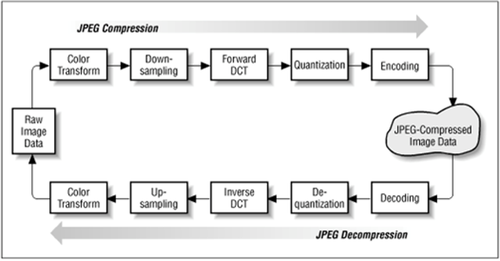
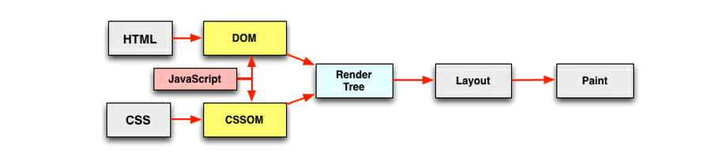

# 前端页面性能优化

## 原理

### 浏览器的一个请求从发送到返回都经历了什么

1.  当发送一个 url 时，浏览器会开启一个线程来处理这个请求，同时在远程 DNS 服务器上启动一个 DNS 查询，这能使浏览器获得请求对应的 IP
2.  浏览器与服务器通过 TCP 三次握手建立连接
3.  浏览器通过 HTTP 发送 Get 请求。远程服务器找到资源并通过 HTTP 返回该资源
4.  浏览器开始下载资源，并将其展现出来

### 请求过程中一些潜在的优化点

* dns 通过缓存减少 dns 查询时间
* 相同静态资源缓存
* 减少 http 请求大小
* 减少 http 请求次数
* 服务端渲染

## 资源合并与压缩

### 使用在线网站进行压缩

http://tool.oschina.net/jscompress/

### 构建工具自动压缩合并

[fis3](https://github.com/fex-team/fis3)
[webpack](https://www.webpackjs.com/)

### 文件合并

**存在的问题**

首屏渲染问题和缓存失效问题，文件合并虽然减少了请求 http 的数量，但是也增大了文件的大小，首屏的加载需要等到整个文件加载完才可以正常显现。

**解决的方法**

公共库合并，不同页面的合并

## 图片相关优化

### 理论原理

**一张图片的解析过程**

原图片进行颜色的转换，然后转换成高频或者低频，然后对其进行相应的DCT，最后将其量化并编码

**不同格式图片常用的业务场景**

- jpg 有损压缩，压缩率高，不支持透明
- png 支持透明，浏览器兼容好
- webp 压缩程度更好，在 ios webview有兼容性问题
- svg 矢量图，代码内嵌，相对较小，图片样式相对简单的场景

### 处理方式

**图片压缩**

针对真实图片情况，舍弃一些相对无关紧要的色彩信息

https://tinypng.com/

**CSS 雪碧图**

把网站上用到的一些图片整合到一张单独的图片中，减少网站 HTTP 请求的数量，缺点就是整合的图片比较大时，一次加载会比较慢

http://www.spritecow.com/

**image inline**

将图片的内容内嵌到 html 中

**矢量图**

使用 SVG 进行矢量图的绘测，使用 iconfont 解决 icon 问题

## CSS 和 JS 的装载与执行

html 渲染与加载的过程

### 加载过程的特点

**顺序执行、并发加载**

- 词法分析
- 并发加载
- 并发上限

**是否阻塞**

- css head 中阻塞页面的渲染
- css 阻塞 js 的执行
- css 不阻塞外部脚本的加载
- 直接引入的 js 阻塞页面的渲染
- js 不阻塞资源的加载
- js 顺序执行，阻塞后续 js 逻辑的执行  

**依赖关系**

- 页面渲染依赖于 css 的加载
- js 的执行顺序的依赖关系
- js 逻辑对于 dom 节点的依赖关系

**引入方式**

- 直接引入
- defer
- async
- 异步动态引入 js
 
### 加载和执行的一些优化点

- css 样式表置顶
- 用 link 代替 import
- js 脚本置底
- 合理使用 js 的异步加载能力

## 懒加载和预加载

### 懒加载

图片进入可是区域之后请求图片资源

### 预加载

图片等静态资源在使用之前的提前请求

## 重绘与回流

### 回流

当 render tree 中的一部分（或全部）因为元素的规模尺寸，布局，隐藏等改变而需要重新构建。这就称为回流「reflow」

**触发页面重布局的属性**

- 盒子模型相关属性会触发重布局  `width` `height` `margin` ...
- 定位属性及浮动也会触发重布局  `float` `left` ...
- 改变节点内部文字结构也会触发重布局 `text-align` `line-height` `font-size` ...

### 重绘

当 render tree 中的一些元素需要更新属性，而这些属性只是影响元素的外观，风格，而不会影响布局的，比如 `background-color`。这就成为重绘

**触发页面重绘的属性**

`color` `backgroud`..

### 新建 DOM 的过程

1. 获取 DOM 后分割为多少个图层  
2. 对每个图层的节点计算样式结果
3. 为每个节点生成图形和位置 （Layout -- 回流和重布局）
4. 为每个节点绘制填充到图层位置 （Paint Setup 和 Paint 重绘）
5. 图层作为纹理上传至 GPU
6. 符合多个图层到页面上生成最终屏幕图像

### 实战优化点

1. 用 `translate` 替代 `top` 改变，前者不会触发回流
2. 用 `opacity` 替代 `visibility`，前者不会触发重绘，更不会触发回流
3. 不要一条一条地修改 DOM 的样式，预先定义好 `class`，然后修改 DOM 的 `className`
4. 把 DOM 离线后修改，比如：先把 DOM 给 `display:none` (有一次 Reflow)，然后你修改 100 次，然后再把它显示出来
5. 不要把 DOM 结点的属性值放在一个循环里当成循环里的变量
6. 不要使用 `table` 布局，可能很小的一个小改动会造成整个 `table` 的重新布局
7. 动画实现的速度的选择
8. 对于动画新建图层
9. 启用 GPU 硬件加速 `transform:translateZ(0);transfrom:tranlate3D(0,0,0)`

