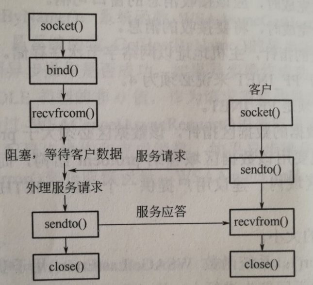
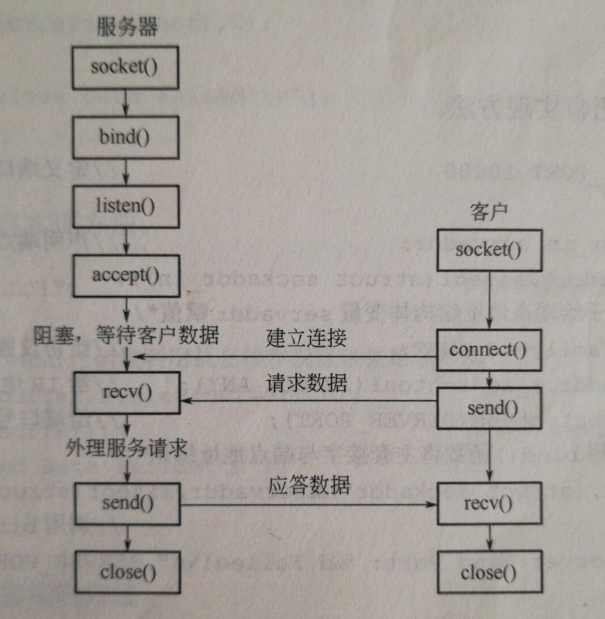
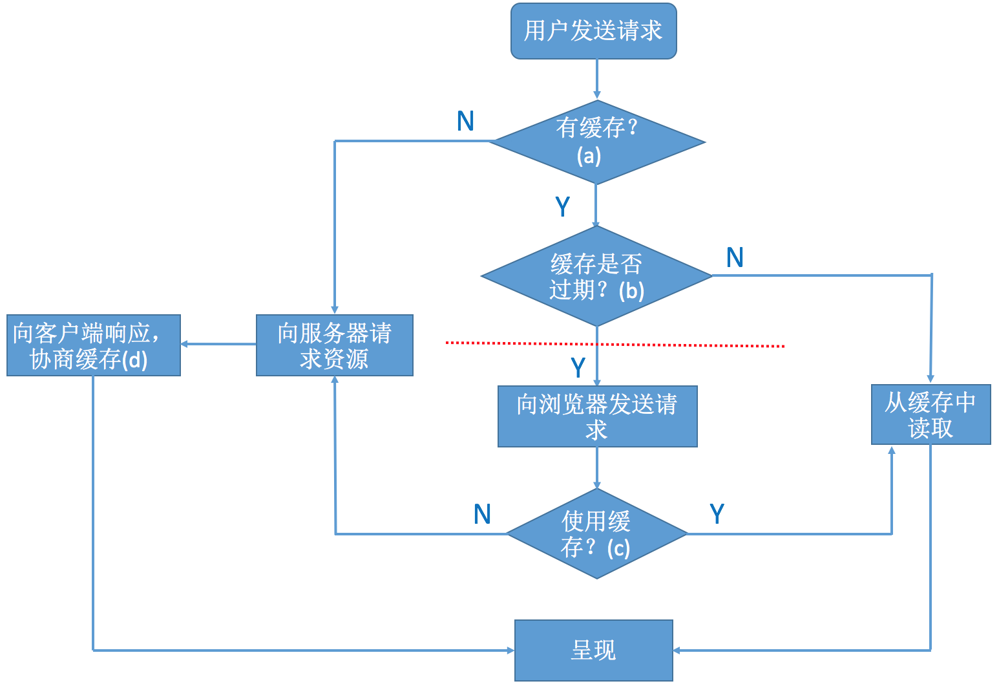

## HTML CSS

### 简述一下你对HTML语义化的理解？

- 用正确的标签做正确的事情。
- `html` 语义化让页面的内容结构化，结构更清晰，便于对浏览器、搜索引擎解析;
- 即使在没有样式 CSS 情况下也以一种文档格式显示，并且是容易阅读的;
- 搜索引擎的爬虫也依赖于HTML标记来确定上下文和各个关键字的权重，利于 SEO ;
- 使阅读源代码的人对网站更容易将网站分块，便于阅读维护理解简述一下你对HTML语义化的理解？

### Doctype作用？标准模式与兼容模式各有什么区别?

`<!DOCTYPE>` 声明位于位于 HTML 文档中的第一行，处于 `<html>` 标签之前。告知浏览器的解析器用什么文档标准解析这个文档。`DOCTYPE` 不存在或格式不正确会导致文档以兼容模式呈现
标准模式的排版 和 JS 运作模式都是以该浏览器支持的最高标准运行。在兼容模式中，页面以宽松的向后兼容的方式显示,模拟老式浏览器的行为以防止站点无法工作

### 怎么让一个不定宽高的 DIV，垂直水平居中?

**使用Flex**

只需要在父盒子设置

```css
display: flex;
justify-content: center;
align-items: center;
```

**使用 CSS3 transform**

父盒子设置 `position:relative`

Div 设置:

```css
transform: translate(-50%，-50%);
position: absolute;top: 50%;
left: 50%;
```

**使用 display:table-cell 方法**

父盒子设置:

```css
display:table-cell;
text-align:center;
vertical-align:middle;
``` 

Div 设置: 

```css
display:inline-block;
vertical-align:middle;
```

### 如何清除浮动？

**首先说为什么要清除浮动**

浮动的出现一开始只是为了解决文字环绕问题，用浮动实现页面布局本来不是应该他干的事情，子元素设置浮动后，会脱离标准文档流，造成父元素高度塌陷

**清除浮动**

```js
.clearfloat{
  zoom:1;
}
.clearfloat:after{
  display:block;
  content:'';
  clear:both;
  height:0; 
  visibility:hidden;
}
```

### 了解 BFC 吗？

BFC(Block formatting context)直译为「块级格式化上下文」。它是一个独立的渲染区域，只有 Block-level box 参与， 它规定了内部的 Block-level Box 如何布局，并且与这个区域外部毫不相干。

BFC 布局规则 BFC 就是页面上的一个**隔离的独立容器，容器里面的子元素不会影响到外面的元素。反之也如此**。

### box-sizing 是什么

设置 css 盒模型为标准模型或 IE 模型

**标准盒模型** 的宽度只包含 `content`，**IE盒模型**包括 `border` 和 `padding`，`box-sizing` 可以设置三个值

- `content-box` : 默认值，只计算内容的宽度，标准盒模型
- `padding-box` : `padding` 计算入宽度内
- `border-box` : IE 盒模型

### CSS 隐藏元素的方式和区别

**display:none**

元素在页面上彻底消失，元素本来占有的空间会被其它元素占有，会导致浏览器的重排和重绘，也不会触发其中的事件

**visibility:hidden**

元素在页面消失，但是**本来占有的空间依旧会保留着**，所以只会导致浏览器**重绘**，也不会触发其中的事件

**opacity:0**

这种单单只是视觉上的隐藏，可以触发其中的事件，空间也会被保留

### 行内元素有哪些，块级元素有哪些?

行内元素：a、b、span、img、input、strong、select、label、em、button、textarea

块状元素: div、ul、li、dl、dt、dd、p、h1-h6、blockquote

### line-height 中需要注意的问题

`%` 和 `em` 是按照声明 `line-height` 处的 `font-size` 计算的，`line-height `为数字则是按每个元素继承或声明的 `font-size` 计算得到的

### 你做的网页在哪些浏览器测试过,这些浏览器的内核分别是什么?

- IE: trident 内核
- Firefox ： gecko 内核
- Safari:webkit 内核
- Opera: 以前是 presto 内核， Opera 现已改用 Google Chrome 的 Blink 内核
- Chrome:Blink( 基于 webkit ， Google 与 Opera Software 共同开发 )

### CSS 有哪些样式可以给子元素继承

- 可继承的: `font-size`,`font-weight`,`line-height`,`color`,`cursor` 等
- 不可继承的一般会是改变盒子模型的: `display`,`margin`,`border`,`padding`,`height` 等

### 样式权重的优先级

`!import` > 行内样式 > `id` > `css` > `tag`

如果将其转化为数字理解的话从 `tag` 为 1, `css` 为 10,`id` 为 100

## JS

### 数据类型都有哪些

String,Number,Object,Array,null,undefined,Boolean,Symbol

### js本地对象

Object,Function,Array,String,Boolean,Number,Date,RegExp,Error

### New 原理
  。

```js
var obj = {};
obj.__proto__ = Base.prototype;
Base.call(obj);
```

### 准确的判断一个值的类型

```js
Object.prototype.toString.call(value)
```

调用 `Object `的 `toString` 方法

### 简要说下原型与原型链

在 JavaScript 中原型是一个 `prototype` 对象，用于表示类型之间的关系。

JavaScript 万物都是对象，对象和对象之间也有关系，并不是孤立存在的。对象之间的继承关系，在 JavaScript 中是通过 `prototype` 对象指向父类对象，直到指向 Object 对象为止，这样就形成了一个原型指向的链条，专业术语称之为原型链。

`prototype` 是函数的属性，用来设置原型对象

`__proto__` 是对象的属性，值即为对象的原型

### `Object` 和 `Function` 的鸡和蛋的问题

先有 `Object.prototype` （原型链顶端），`Function.prototype` 继承 `Object.prototype` 而产生，最后，`Function` 和 `Object` 和其它构造函数继承 `Function.prototype` 而产生。

### 数组对空位的处理

`forEach()`, `filter()`, `reduce()`, `every()` 和 `some()` 都会跳过空位。

`map()` 会跳过空位，但会保留这个值

`join()` 和 `toString()` 会将空位视为 `undefined`，而 `undefined` 和 `null` 会被处理成空字符串。

ES6 中的方法都会将空位处理为 `undefined`

### 数组去重

```js
[...new Set(arr)]
```

### 两个实例对象的拷贝

如果要拷贝一个对象，要做到下面两件事件

- 确保拷贝后的对象，与原对象具有同样的原型
- 确保拷贝后的对象，与原对象具有同样的实例属性

```js
function copyObject(orig) {
  return Object.create(
    Object.getPrototypeOf(orig),
    Object.getOwnPropertyDescriptors(orig)
  );
}
```

**Object.create的原理**

```js
function(obj){
  function F(){};
  F.prototype = obj;
  return new F();
}
```

**解决兼容的深拷贝**

```js
function deepClone(source, target={}){
  for(key in source){
    if(source.hasOwnProperty(key)){//原型上的实例不拷贝
      if(typeof(source[key]) === "object"){
        tartget(key) = Array.isArray(source[key]) ? [] : {};
        deepCopy(source[key],target);
      }else{
        target[key] = source[key];
      }
    }
  }
  return target;
}
```

### 闭包

自己理解就是私有变量共有化

```js
let a = 12;
function A(){
  let a = 10;
  return function(){
    console.log(a);
  }
}

var B = A();
B();
```

### 事件流

事件捕获 -> 目标阶段 -> 事件冒泡

### 阻止冒泡和浏览器默认行为

```js
e = e || window.event
//阻止冒泡
e.stopPropagation() || e.cancelBubble

//阻止默认事件
e.preventDefault() || e.returnValue = false
```

## HTTP

### 如何实现浏览器内多个标签页之间的通信?

WebSocket、SharedWorker
也可以调用localstorge、cookies等本地存储方式

### get 和 post 的区别

- GET 在浏览器回退时是无害的，而 POST 会再次提交请求。
- GET 请求会被浏览器主动缓存，而 POST 不会，除非手动设置。
- GET 请求只能进行 url 编码，而 POST 支持多种编码方式。
- GET 请求在 URL 中传送的参数是有长度限制的，而 POST 没有。
- 对参数的数据类型，GET 只接受 ASCII 字符，而 POST 没有限制。
- GET 比 POST 更不安全，因为参数直接暴露在 URL 上，所以不能用来传递敏感信息。
- GET 参数通过 URL 传递，POST 放在 Request body中。

### cookie

Cookie 的大小一般不超过 4kb

**Cookie** 的组成

- Cookie 的名字
- Cookie 的值
- 到期时间
- 所属的域名 （当前域名）
- 生效的路径 （默认当前网址）

### session

session 是为了维持客户端和服务器会话，通过 session 判断当前用户的身份，可以存储数组和对象，存活至浏览器关闭

session 机制是一种服务器端的机制，

[session的机制](http://justsee.iteye.com/blog/1570652)

### localStroage

不能设置过期时间，可存储数组和对象，存储在本地，相当于自己的 d 盘


### 一个页面输入URL到页面加载完成，这个过程都发生了什么？

1. 当发送一个 url 时，浏览器会开启一个线程来处理这个请求，同时在远程 DNS 服务器上启动一个 DNS 查询，这能使浏览器获得请求对应的 IP
2. 浏览器与服务器通过 TCP 三次握手建立连接
3. 浏览器通过 HTTP 发送 Get 请求。远程服务器找到资源并通过 HTTP 返回该资源
4. 浏览器开始下载资源，并将其展现出来

### HTTP1.0 和 HTTP1.1 的区别

#### 持久连接

在 HTTP 1.0 中，每对 Request/Response 都使用一个新的连接。规定浏览器与服务器只保持短暂的连接，浏览器的每次请求都需要与服务器建立一个 TCP 连接，**服务器完成请求处理后立即断开** TCP 连接，服务器不跟踪每个客户也不记录过去的请求，如果手动向 `Connection` 添加 `Keep-Alive` 也可以实现长连接

通常，HTTP/1.0 的 `Proxy` 不支持 Connection 头域，为了不让它们转发可能误导接收者的头域，协议规定所有出现在 Connection 头域中的头域名都将被忽略。

HTTP1.1 默认开启长连接，Connection 请求头的值为 `Keep-Alive` 时，客户端通知服务器本次请求返回长连接，这样在同一个 tcp 的连接中可以传送多个 HTTP 请求和响应；当 Connection 为 `close` 时，客户端通知服务器本次请求结果后直接关闭连接。

HTTP1.1 还提供了身份认证，状态管理和 Cache 缓存等机制相关的请求头和响应头

#### Host 域

在 HTTP1.0 中认为每台服务器都绑定一个唯一的 IP 地址，因此，请求消息中的 URL 并没有传递主机名。但随着虚拟主机技术的发展，在一台物理服务器上可以存在多个虚拟主机，并且它们共享一个 IP 地址，因此 Web 浏览器就无法明确表示要访问服务器上的哪个 Web 站点。

在 HTTP1.1 中增加了 Host 域，请求消息和请求头都应支持 Host 域，且如果请求头和请求消息没有 Host 域会报一个错误「400 Bad Request」。

服务器应该接受以绝对路径标记的资源请求。

#### Transfer Codings

HTTP 消息可以包含任意长度的实体，通常它们采用 Content-Length 来给出消息结束标志。但是，对于很多动态产生的响应，只能通过缓冲完整的消息来判断消息的大小，但这样会加大延迟。

HTTP1.1 引入 Chunked transfer-coding 来解决，发送方将消息分割成若干个任意大小的数据块，每个数据块在发送的时候都会附上块的长度，最后用一个零长度的块作为消息结束的标志。这种方法允许发送方只缓冲消息的一个片段，避免缓冲整个消息带来的过载

#### 节约带宽

HTTP1.1 加入一个新的状态码 100 「Continue」。客户端事先发送一个只带头域的请求，如果服务器因为权限拒绝了请求，就返回响应码 401 「没有被授权」;如果服务器返回 100 ,则客户端可以继续发送带实体的完整请求

#### Cache

在HTTP/1.0中，使用 Expire 头域来判断资源的 fresh 或 stale，并使用条件请求「conditional request」来判断资源是否仍有效。例如，cache 服务器通过 If-Modified-Since 头域向服务器验证资源的 Last-Modefied 头域是否有更新，源服务器可能返回 304「Not Modified」，则表明该对象仍有效；也可能返回 200 替换请求的 Cache 对象。

HTTP1.1中，引入 ETag 头域用于重激活机制，增加 Cache-Control ，它支持一个可扩展的指令子集：例如 max-age 指令支持相对时间戳；private 和 no-store 指令禁止对象被缓存；no-transform阻止 Proxy 进行任何改变响应的行为。

### HTTP2.0

#### 增加二进制分帧

HTTP2.0 会将所有传输信息分割为更小的消息和帧，并对他们采用二进制编码。其中HTTP1.1的首部信息会被封装到 Headers 帧，request body 中的数据会被封装到 Data 帧

#### 多路复用


这意味着 HTTP2.0 的通信都在一个连接上完成了，这个连接可以承载任意数量的双向数据流，直观来讲，就是减少 http 请求的前端性能优化都以不再需要了

#### 请求优先级

所有资源可以并行交错发送， 那想要优先拿到 CSS 和 JS 而不是图片怎么办，在每个 HTTP 2.0 的流里面有个优先值，这个优先值确定着客户端跟服务器处理不同的流采取不同的优先级策略，高优先级优先发送，但这不是绝对的「绝对等待会导致首队阻塞问题」

#### 服务器提示

HTTP 2.0 新增加服务器提示，可以**先于客户端检测到将要请求的资源**，提前通知客户端，服务器不发送所有资源的实体，只发送资源的 URL，客户端接到提示后会进行验证缓存，如果真需要这些资源，则正式发起请求（服务器主动更新静态资源）


### 关于跨域

https://segmentfault.com/a/1190000011145364

### TCP 与 UDP 的区别



**UDP服务器端算法的实现流程**

1. 调用 `socket()` 函数创建服务器端 UDP 套接字
2. 调用 `bind()` 函数将该 UDP 套接字绑定到本机的一个可用的端点地址
3. 调用 `recvfrom()` 函数从该 UDP 套接字接受来自远程客户端的数据并存入缓冲区，同时获得远程客户端的套接字端点地址并保存
4. 基于保存的远程客户端的套接字端点地址，调用 `sendTo()` 函数将缓冲区的数据从该套接字发送给远程客户端
5. 与客户交互完毕，调用 `close()` 函数将该 UDP 套接字关闭，释放系统所占的资源

**UDP客户端算法的实现流程**

1. 调用 `socket` 函数创建客户端 UDP 套接字
2. 找到期望与之通信的远程服务器的 IP 地址和协议端口号；然后再调用 `sendTo()` 函数将缓冲区的数据从 UDP 套接字发送给服务器端
3. 调用 `recvfrom()` 函数从该 UDP 套接字接受来自远程服务器端的数据并存入缓冲区
4. 调用 `close()` 将 UDP 套接字关闭，释放系统所占的资源



**TCP服务器端算法的实现流程**

1. 调用 `socket` 函数创建服务器端 TCP 主套接字
2. 调用 `bind` 函数将该套接字绑定到本机的一个可用端口
3. 调用 `listen` 函数将该套接字设置为被动模式，并设置等待队列的长度
4. 调用 `accept` 函数从该套接字上接受一个新客户连接请求，并在**连接成功**之后为该 TCP 连接**创建**一个新的从套接字
5. 基于新创建的套接字，调用 `recv` 接受来自客户端的数据并缓存
6. 基于新创建的套接字，调用 `send` 将缓冲区的数据发送给客户端
7. 与客户交互完毕，调用 `close` 关闭从套接字
8. 与所有客户交互完毕，调用 `close` 关闭主套接字

**TCP客户端算法的实现流程**

1. 调用 `socket` 函数创建客户端 TCP 套接字
2. 找到期望与之通信的服务器端套接字的端点地址，然后通过 `connect` 与远程服务器发起 TCP 连接请求
3. 在与服务器成功建立起 TCP 请求时调用 `send` 函数将缓冲区中的数据从套接字发送给远程服务端
4. 调用 `recv` 来接受服务器端发送的数据
5. 调用 `close` 关闭套接字


**TCP与UDP区别总结**

- TCP 面向连接，需要连接才能传送数据；UDP 不需要连接，即发送数据之前不需要连接
- TCP 提供可靠的服务，数据无差错，不丢失，不重复，且按序到达；UDP 尽最大努力交付，但不可靠
- TCP 面向字节流；UDP面向报文，没有拥塞控制
- TCP 连接只能是点到点；UDP 支持一对一，多对多，多对一，一对多
- TCP 首部开销 20 字节；UDP 首部开销小，只有 8 个字节

### 浏览器缓存机制

#### 两个概念

**强缓存**

用户发送的请求，直接从客户端缓存中获取，不发送请求到服务器，不与服务器发生交互行为

**协商缓存**

用户发送请求，发送到服务器后，由服务器判断是否发送从缓存中取出数据

#### 流程



**浏览器判定是否有缓存**

拿 chrome 举例，在网址中输入 `chrome://cache` 就可以看到缓存的文件，如果浏览器找不到文件，则证明没有缓存

**缓存是否过期**

一般通过两个字段判断

-expires

HTTP 1.0 中的标准，表明过期时间，时间为服务器的时间，但是因为客户端的时间和服务器时间有可能不相同，因此会导致出现差错

-Cache-Control

HTTP 1.1中的标准，其中有几个重要的属性

- max-age 设置缓存的最大有效时间，max-age 会覆盖掉 expires
- s-maxage 用于代理缓存，会覆盖掉 max-age 和 expires
- public 允许多用户共享缓存，默认值
- privat 响应为私有缓存
- no-cache 缓存前要向服务器确认
- no-store 禁止缓存
- must-revaidate 如果页面过期，则去服务器进行获取

首先查看是否有 Cache-Control 如果没有，则根据 expires 比较过期时间，如果有，则根据 max-age 或 s-maxage 计算和判断过期的时间，如果没有过期，则就使用客户端缓存，就是执行 「强缓存」

**跟服务器协商是否使用缓存**

浏览器会像服务器发送请求，如果上次缓存中存在 Etag 和 Last-modified 字段

浏览器将在 request header 中加入If-Modified-Since(对应 Last-modified) 和 If-None-Match(对应于 Etag)

- Last-modified 请求资源上次修改的时间
- If-Modified-Since 客户端保留的资源上次修改的时间
- Etag 内容标识符「不唯一，保证写入和验证时方法相同就可以」
- If-None-Match 客户端保留的内容标识符

**协商缓存**

服务器一般会将 Cache-control,expires,last-modified,data,etag 等在 request body 中返回,便于下次缓存


### 浏览器几种缓存

http，websql，indexDB，cookie，session，localStorage，application cache，cache Storage，flash
 

