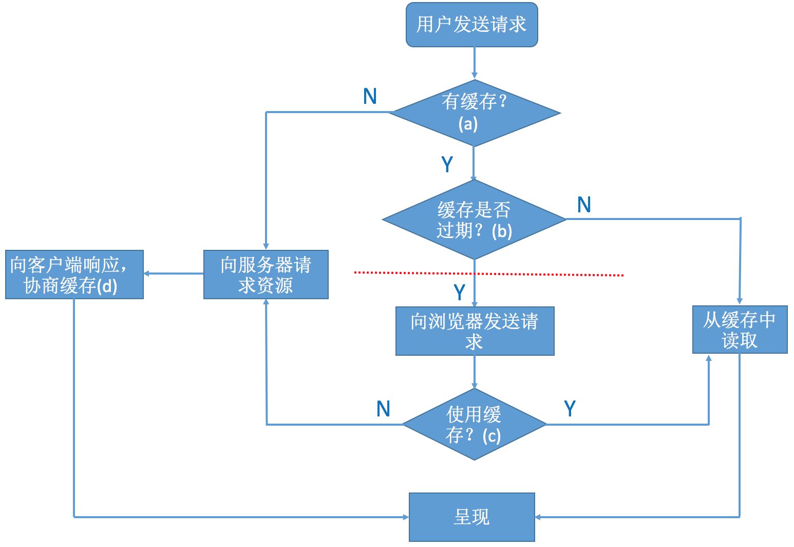

### 浏览器缓存机制

#### 两个概念

**强缓存**

用户发送的请求，直接从客户端缓存中获取，不发送请求到服务器，不与服务器发生交互行为

**协商缓存**

用户发送请求，发送到服务器后，由服务器判断是否发送从缓存中取出数据

#### 流程

**浏览器判定是否有缓存**

拿 chrome 举例，在网址中输入 `chrome://cache` 就可以看到缓存的文件，如果浏览器找不到文件，则证明没有缓存

**缓存是否过期**

一般通过两个字段判断

-expires

HTTP 1.0 中的标准，表明过期时间，时间为服务器的时间，但是因为客户端的时间和服务器时间有可能不相同，因此会导致出现差错

-Cache-Control

HTTP 1.1中的标准，其中有几个重要的属性

- max-age 设置缓存的最大有效时间，max-age 会覆盖掉 expires
- s-maxage 用于代理缓存，会覆盖掉 max-age 和 expires
- public 允许多用户共享缓存，默认值
- privat 响应为私有缓存
- no-cache 缓存前要向服务器确认
- no-store 禁止缓存
- must-revaidate 如果页面过期，则去服务器进行获取

首先查看是否有 Cache-Control 如果没有，则根据 expires 比较过期时间，如果有，则根据 max-age 或 s-maxage 计算和判断过期的时间，如果没有过期，则就使用客户端缓存，就是执行 「强缓存」

**跟服务器协商是否使用缓存**

浏览器会像服务器发送请求，如果上次缓存中存在 Etag 和 Last-modified 字段

Last-modified 有两点缺点：某些服务器不能获取精确的修改时间；文件时间修改了，单文件内容没有变，因此会有 Etag 的出现

浏览器将在 request header 中加入If-Modified-Since(对应 Last-modified) 和 If-None-Match(对应于 Etag)

- Last-modified 请求资源上次修改的时间
- If-Modified-Since 客户端保留的资源上次修改的时间
- Etag 内容标识符「不唯一，保证写入和验证时方法相同就可以」
- If-None-Match 客户端保留的内容标识符

**协商缓存**

服务器一般会将 Cache-control,expires,last-modified,data,etag 等在 request body 中返回,便于下次缓存

### 浏览器几种缓存

http，websql，indexDB，cookie，session，localStorage，application cache，cache Storage，flash

### cookie

Cookie 的大小一般不超过 4kb

**Cookie** 的组成

- Cookie 的名字
- Cookie 的值
- 到期时间
- 所属的域名 （当前域名）
- 生效的路径 （默认当前网址）

### session

session 是为了维持客户端和服务器会话，通过 session 判断当前用户的身份，可以存储数组和对象，存活至浏览器关闭

session 机制是一种服务器端的机制，

[session的机制](http://justsee.iteye.com/blog/1570652)

### localStroage

不能设置过期时间，可存储数组和对象，存储在本地，相当于自己的 d 盘

### cookie 和 session 的区别

#### 存取方式不同

cookie 中只能保管 ASCII 字符串，假如需求存取Unicode字符或者二进制数据，需求先进行编码

session 中能够存取任何类型的数据

#### 隐私策略不同

cookie 存储在客户端中，对客户端是可见的

session 存储在服务端，对客户端是透明的

#### 有效期不同

cookie 可以设置有效期时间为很长也可以很短

session 在浏览器关闭后就结束

#### 服务器压力不同

session 保管在服务器中，每个用户都会产生一个 session

cookie 保管在客户端，不占用服务器的资源

#### 浏览器支持不同

cookie 是需要客户端浏览器支持的

#### 跨域支持

cookie 支持跨域，只需要将 `document.domain` 设置为 `www.hutchins.cn` ，则在此之下的域名都可以访问

