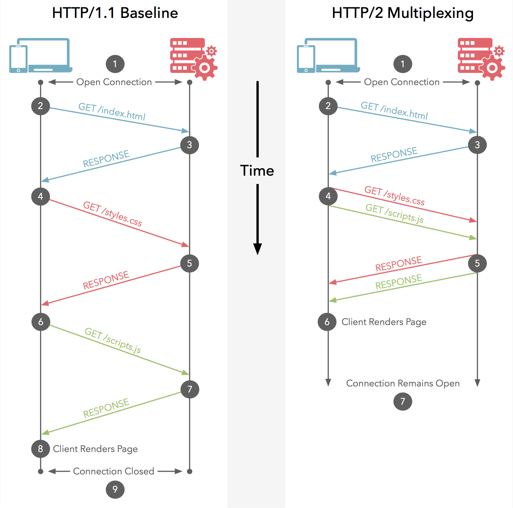
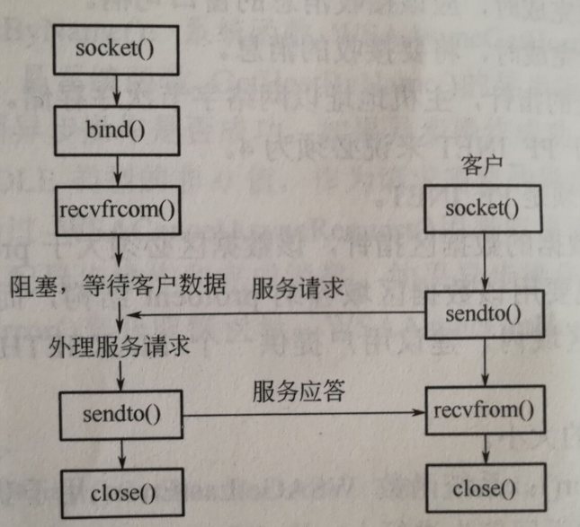

### 一个页面输入URL到页面加载完成，这个过程都发生了什么？

1. 当发送一个 url 时，浏览器会开启一个线程来处理这个请求，同时在远程 DNS 服务器上启动一个 DNS 查询，这能使浏览器获得请求对应的 IP
2. 浏览器与服务器通过 TCP 三次握手建立连接
3. 浏览器通过 HTTP 发送 Get 请求。远程服务器找到资源并通过 HTTP 返回该资源
4. 浏览器开始下载资源，并将其展现出来

### get 和 post 的区别

- GET 在浏览器回退时是无害的，而 POST 会再次提交请求。
- GET 请求会被浏览器主动缓存，而 POST 不会，除非手动设置。
- GET 请求只能进行 url 编码，而 POST 支持多种编码方式。
- GET 请求在 URL 中传送的参数是有长度限制的，而 POST 没有。
- 对参数的数据类型，GET 只接受 ASCII 字符，而 POST 没有限制。
- GET 比 POST 更不安全，因为参数直接暴露在 URL 上，所以不能用来传递敏感信息。
- GET 参数通过 URL 传递，POST 放在 Request body中。

### HTTP1.0 和 HTTP1.1 的区别

#### 持久连接

在 HTTP 1.0 中，每对 Request/Response 都使用一个新的连接。规定浏览器与服务器只保持短暂的连接，浏览器的每次请求都需要与服务器建立一个 TCP 连接，**服务器完成请求处理后立即断开** TCP 连接，服务器不跟踪每个客户也不记录过去的请求，如果手动向 `Connection` 添加 `Keep-Alive` 也可以实现长连接

通常，HTTP/1.0 的 `Proxy` 不支持 Connection 头域，为了不让它们转发可能误导接收者的头域，协议规定所有出现在 Connection 头域中的头域名都将被忽略。

HTTP1.1 默认开启长连接，Connection 请求头的值为 `Keep-Alive` 时，客户端通知服务器本次请求返回长连接，这样在同一个 tcp 的连接中可以传送多个 HTTP 请求和响应；当 Connection 为 `close` 时，客户端通知服务器本次请求结果后直接关闭连接。

HTTP1.1 还提供了身份认证，状态管理和 Cache 缓存等机制相关的请求头和响应头

#### Host 域

在 HTTP1.0 中认为每台服务器都绑定一个唯一的 IP 地址，因此，请求消息中的 URL 并没有传递主机名。但随着虚拟主机技术的发展，在一台物理服务器上可以存在多个虚拟主机，并且它们共享一个 IP 地址，因此 Web 浏览器就无法明确表示要访问服务器上的哪个 Web 站点。

在 HTTP1.1 中增加了 Host 域，请求消息和请求头都应支持 Host 域，且如果请求头和请求消息没有 Host 域会报一个错误「400 Bad Request」。

服务器应该接受以绝对路径标记的资源请求。

#### Transfer Codings

HTTP 消息可以包含任意长度的实体，通常它们采用 Content-Length 来给出消息结束标志。但是，对于很多动态产生的响应，只能通过缓冲完整的消息来判断消息的大小，但这样会加大延迟。

HTTP1.1 引入 Chunked transfer-coding 来解决，发送方将消息分割成若干个任意大小的数据块，每个数据块在发送的时候都会附上块的长度，最后用一个零长度的块作为消息结束的标志。这种方法允许发送方只缓冲消息的一个片段，避免缓冲整个消息带来的过载

#### 节约带宽

HTTP1.1 加入一个新的状态码 100 「Continue」。客户端事先发送一个只带头域的请求，如果服务器因为权限拒绝了请求，就返回响应码 401 「没有被授权」;如果服务器返回 100 ,则客户端可以继续发送带实体的完整请求

#### Cache

在HTTP/1.0中，使用 Expire 头域来判断资源的 fresh 或 stale，并使用条件请求「conditional request」来判断资源是否仍有效。例如，cache 服务器通过 If-Modified-Since 头域向服务器验证资源的 Last-Modefied 头域是否有更新，源服务器可能返回 304「Not Modified」，则表明该对象仍有效；也可能返回 200 替换请求的 Cache 对象。

HTTP1.1中，引入 ETag 头域用于重激活机制，增加 Cache-Control ，它支持一个可扩展的指令子集：例如 max-age 指令支持相对时间戳；private 和 no-store 指令禁止对象被缓存；no-transform阻止 Proxy 进行任何改变响应的行为。

### HTTP2.0

#### 增加二进制分帧

HTTP2.0 会将所有传输信息分割为更小的消息和帧，并对他们采用二进制编码。其中HTTP1.1的首部信息会被封装到 Headers 帧，request body 中的数据会被封装到 Data 帧

#### 多路复用

这意味着 HTTP2.0 的通信都在一个连接上完成了，这个连接可以承载任意数量的双向数据流，直观来讲，就是减少 http 请求的前端性能优化都以不再需要了

#### 请求优先级

所有资源可以并行交错发送， 那想要优先拿到 CSS 和 JS 而不是图片怎么办，在每个 HTTP 2.0 的流里面有个优先值，这个优先值确定着客户端跟服务器处理不同的流采取不同的优先级策略，高优先级优先发送，但这不是绝对的「绝对等待会导致首队阻塞问题」

#### 服务器提示

HTTP 2.0 新增加服务器提示，可以**先于客户端检测到将要请求的资源**，提前通知客户端，服务器不发送所有资源的实体，只发送资源的 URL，客户端接到提示后会进行验证缓存，如果真需要这些资源，则正式发起请求（服务器主动更新静态资源）

### TCP 与 UDP 的区别

**UDP服务器端算法的实现流程**

1. 调用 `socket()` 函数创建服务器端 UDP 套接字
2. 调用 `bind()` 函数将该 UDP 套接字绑定到本机的一个可用的端点地址
3. 调用 `recvfrom()` 函数从该 UDP 套接字接受来自远程客户端的数据并存入缓冲区，同时获得远程客户端的套接字端点地址并保存
4. 基于保存的远程客户端的套接字端点地址，调用 `sendTo()` 函数将缓冲区的数据从该套接字发送给远程客户端
5. 与客户交互完毕，调用 `close()` 函数将该 UDP 套接字关闭，释放系统所占的资源

**UDP客户端算法的实现流程**

1. 调用 `socket` 函数创建客户端 UDP 套接字
2. 找到期望与之通信的远程服务器的 IP 地址和协议端口号；然后再调用 `sendTo()` 函数将缓冲区的数据从 UDP 套接字发送给服务器端
3. 调用 `recvfrom()` 函数从该 UDP 套接字接受来自远程服务器端的数据并存入缓冲区
4. 调用 `close()` 将 UDP 套接字关闭，释放系统所占的资源

**TCP服务器端算法的实现流程**

1. 调用 `socket` 函数创建服务器端 TCP 主套接字
2. 调用 `bind` 函数将该套接字绑定到本机的一个可用端口
3. 调用 `listen` 函数将该套接字设置为被动模式，并设置等待队列的长度
4. 调用 `accept` 函数从该套接字上接受一个新客户连接请求，并在**连接成功**之后为该 TCP 连接**创建**一个新的从套接字
5. 基于新创建的套接字，调用 `recv` 接受来自客户端的数据并缓存
6. 基于新创建的套接字，调用 `send` 将缓冲区的数据发送给客户端
7. 与客户交互完毕，调用 `close` 关闭从套接字
8. 与所有客户交互完毕，调用 `close` 关闭主套接字

**TCP客户端算法的实现流程**

1. 调用 `socket` 函数创建客户端 TCP 套接字
2. 找到期望与之通信的服务器端套接字的端点地址，然后通过 `connect` 与远程服务器发起 TCP 连接请求
3. 在与服务器成功建立起 TCP 请求时调用 `send` 函数将缓冲区中的数据从套接字发送给远程服务端
4. 调用 `recv` 来接受服务器端发送的数据
5. 调用 `close` 关闭套接字

**TCP与UDP区别总结**

- TCP 面向连接，需要连接才能传送数据；UDP 不需要连接，即发送数据之前不需要连接
- TCP 提供可靠的服务，数据无差错，不丢失，不重复，且按序到达；UDP 尽最大努力交付，但不可靠
- TCP 面向字节流；UDP面向报文，没有拥塞控制
- TCP 连接只能是点到点；UDP 支持一对一，多对多，多对一，一对多
- TCP 首部开销 20 字节；UDP 首部开销小，只有 8 个字节

